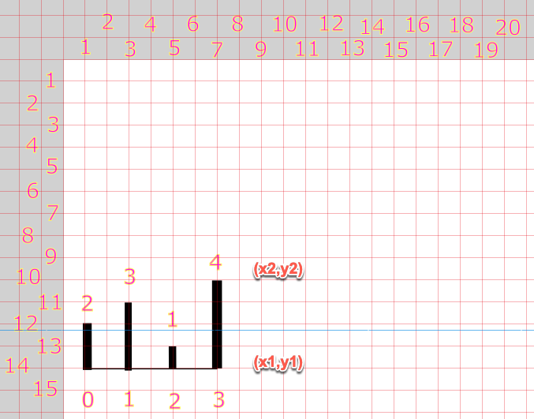
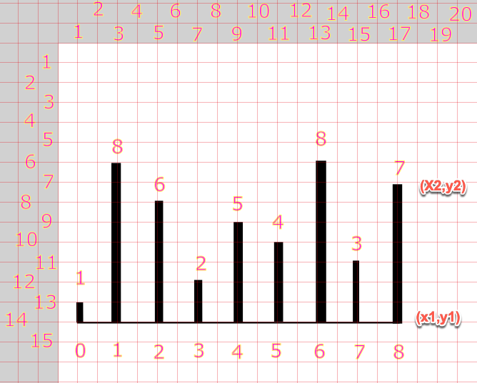

# TypeScript Container With Most Water

## Calculations for Area

____
### Example 1

| Index | Pointer | Comparer | Height | Width | Area |
|-------|---------|----------|--------|-------|------|
| 0     | 0       | 1        | 1      | 1     | 1    |
| 1     | 0       | 2        | 1      | 2     | 2    |
| 2     | 0       | 3        | 1      | 3     | 3    |
| 3     | 0       | 4        | 1      | 4     | 4    |
| 4     | 0       | 5        | 1      | 5     | 5    |
| 5     | 0       | 6        | 1      | 6     | 6    |
| 6     | 0       | 7        | 1      | 7     | 7    |
| 7     | 0       | 8        | 1      | 8     | 8    |
| 8     | 1       | 0        | 1      | 1     | 1    |
| 9     | 1       | 2        | 6      | 1     | 6    |
| 10    | 1       | 3        | 2      | 2     | 4    |
| 11    | 1       | 4        | 5      | 3     | 15   |
| 12    | 1       | 5        | 4      | 4     | 16   |
| 13    | 1       | 6        | 8      | 5     | 40   |
| 14    | 1       | 7        | 3      | 6     | 18   |
| 15    | 1       | 8        | 7      | 7     | 49   |
| 16    | 2       | 0        | 1      | 2     | 2    |
| 17    | 2       | 1        | 6      | 1     | 6    |
| 18    | 2       | 3        | 2      | 1     | 2    |
| 19    | 2       | 4        | 5      | 2     | 10   |
| 20    | 2       | 5        | 4      | 3     | 12   |
| 21    | 2       | 6        | 6      | 4     | 24   |
| 22    | 2       | 7        | 3      | 5     | 15   |
| 23    | 2       | 8        | 6      | 6     | 36   |
| 24    | 3       | 0        | 1      | 3     | 3    |
| 25    | 3       | 1        | 2      | 2     | 4    |
| 26    | 3       | 2        | 2      | 1     | 2    |
| 27    | 3       | 4        | 2      | 1     | 2    |
| 28    | 3       | 5        | 2      | 2     | 4    |
| 29    | 3       | 6        | 2      | 3     | 6    |
| 30    | 3       | 7        | 2      | 4     | 8    |
| 31    | 3       | 8        | 2      | 5     | 10   |
| 32    | 4       | 0        | 1      | 4     | 4    |
| 33    | 4       | 1        | 5      | 3     | 15   |
| 34    | 4       | 2        | 5      | 2     | 10   |
| 35    | 4       | 3        | 2      | 1     | 2    |
| 36    | 4       | 5        | 4      | 1     | 4    |
| 37    | 4       | 6        | 5      | 2     | 10   |
| 38    | 4       | 7        | 3      | 3     | 9    |
| 39    | 4       | 8        | 5      | 4     | 20   |
| 40    | 5       | 0        | 1      | 5     | 5    |
| 41    | 5       | 1        | 4      | 4     | 16   |
| 42    | 5       | 2        | 4      | 3     | 12   |
| 43    | 5       | 3        | 2      | 2     | 4    |
| 44    | 5       | 4        | 4      | 1     | 4    |
| 45    | 5       | 6        | 4      | 1     | 4    |
| 46    | 5       | 7        | 3      | 2     | 6    |
| 47    | 5       | 8        | 4      | 3     | 12   |
| 48    | 6       | 0        | 1      | 6     | 6    |
| 49    | 6       | 1        | 8      | 5     | 40   |
| 50    | 6       | 2        | 6      | 4     | 24   |
| 51    | 6       | 3        | 2      | 3     | 6    |
| 52    | 6       | 4        | 5      | 2     | 10   |
| 53    | 6       | 5        | 4      | 1     | 4    |
| 54    | 6       | 7        | 3      | 1     | 3    |
| 55    | 6       | 8        | 7      | 2     | 14   |
| 56    | 7       | 0        | 1      | 7     | 7    |
| 57    | 7       | 1        | 3      | 6     | 18   |
| 58    | 7       | 2        | 3      | 5     | 15   |
| 59    | 7       | 3        | 2      | 4     | 8    |
| 60    | 7       | 4        | 3      | 5     | 15   |
| 61    | 7       | 5        | 3      | 3     | 9    |
| 62    | 7       | 6        | 3      | 1     | 3    |
| 63    | 7       | 8        | 3      | 1     | 3    |
| 64    | 8       | 0        | 1      | 8     | 8    |
| 65    | 8       | 1        | 7      | 7     | 49   |
| 66    | 8       | 2        | 6      | 6     | 36   |
| 67    | 8       | 3        | 2      | 5     | 10   |
| 68    | 8       | 4        | 5      | 4     | 20   |
| 69    | 8       | 5        | 4      | 6     | 12   |
| 70    | 8       | 6        | 7      | 2     | 14   |
| 71    | 8       | 7        | 3      | 1     | 3    |

____
### Example 2 

| Index | Pointer | Comparer | Height | Width | Area |
|-------|---------|----------|--------|-------|------|
| 0     | 0       | 1        | 2      | 1     | 2    |
| 1     | 0       | 2        | 1      | 2     | 2    |
| 2     | 0       | 3        | 2      | 3     | 6    |
| 3     | 1       | 0        | 2      | 1     | 2    |
| 4     | 1       | 2        | 1      | 1     | 1    |
| 5     | 1       | 3        | 3      | 2     | 6    |
| 6     | 2       | 0        | 1      | 2     | 2    |
| 7     | 2       | 1        | 1      | 1     | 1    |
| 8     | 2       | 3        | 1      | 1     | 1    |
| 9     | 3       | 0        | 2      | 3     | 6    |
| 10    | 3       | 1        | 3      | 2     | 6    |
| 11    | 3       | 2        | 1      | 1     | 1    |

## Graph Layout with Scaling Factor

Scale x (Sx) by 40       
Scale y (Sy) by 40   

800px (Width of the canvas) = 20 * Sx     
600px (Height of the canvas) = 15 * Sy     
80px (Width between the Vertical Lines) = 2 * Sx   

____

 ### Example 1

| Index | x1 * Sx      | y1 * Sy   | x2 * Sx     | y2 * Sy      |
|-------|--------------|-----------|-------------|--------------|
| 0     | 1*40 = 40    | 14*40=560 | 1*40 = 40   | 13*40 = 520  | 
| 1     | 3*40 = 120   | 560       | 3*40 = 120  | 6*40 =  240  | 
| 2     | 5*40 = 200   | 560       | 5*40 = 200  | 8*40 =  320  | 
| 3     | 7*40 = 280   | 560       | 7*40 = 280  | 12*40 =  480 | 
| 4     | 9*40 =  360  | 560       | 9*40 = 360  | 9*40 =  360  | 
| 5     | 11*40 =  440 | 560       | 11*40 = 440 | 10*40 = 400  | 
| 6     | 13*40 =  520 | 560       | 13*40 = 520 | 6*40 =  240  | 
| 7     | 15*40 =  600 | 560       | 15*40 = 600 | 11*40 = 440  | 
| 8     | 17*40 =  680 | 560       | 17*40 = 680 | 7*40 =  280  | 

____

### Example 2

| Index | x1 * Sx    | y1 * Sy   | x2 * Sx    | y2 * Sy     |
|-------|------------|-----------|------------|-------------|
| 0     | 1*40 = 40  | 14*40=560 | 1*40 = 40  | 12*40 = 480 | 
| 1     | 3*40 = 120 | 560       | 3*40 = 120 | 11*40 = 440 | 
| 2     | 5*40 = 200 | 560       | 5*40 = 200 | 13*40 = 520 | 
| 3     | 7*40 = 280 | 560       | 7*40 = 280 | 10*40 = 400 | 

