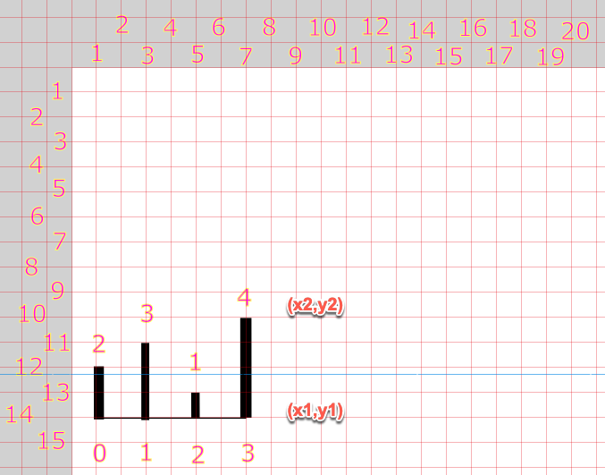
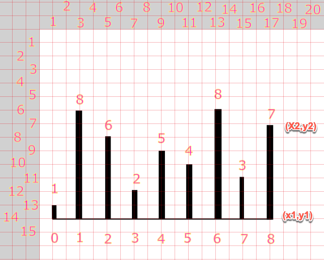

# TypeScript Container With Most Water

## Calcuations for Area

____
### Example 1

| Index       | Pointer     |Comparer     |Height       |Width       |Area        |
| ----------- | ----------- |------------ |-------------|----------- |----------- |
| 0           | 0           | 1           | 1           | 1          | 1          |
| 1           | 0           | 2           | 1           | 2          | 2          |
| 2           | 0           | 3           | 1           | 3          | 3          |
| 3           | 0           | 4           | 1           | 4          | 4          |
| 4           | 0           | 5           | 1           | 5          | 5          |
| 5           | 0           | 6           | 1           | 6          | 6          |
| 6           | 0           | 7           | 1           | 7          | 7          |
| 7           | 0           | 8           | 1           | 8          | 8          |
| 8           | 1           | 0           | 1           | 1          | 1          |
| 9           | 1           | 2           | 6           | 2          | 12         |
| 10          | 1           | 3           | 2           | 3          | 6          |
| 11          | 1           | 4           | 5           | 4          | 20         |
| 12          | 1           | 5           | 4           | 5          | 20         |
| 13          | 1           | 6           | 8           | 6          | 48         |
| 14          | 1           | 7           | 3           | 7          | 21         |
| 15          | 1           | 8           | 7           | 8          | 56         |
| 16          | 2           | 0           | 1           | 1          | 1          |
| 17          | 2           | 1           | 6           | 2          | 12         |
| 18          | 2           | 3           | 2           | 3          | 6          |
| 19          | 2           | 4           | 2           | 4          | 8          |
| 20          | 2           | 5           | 2           | 5          | 10         |
| 21          | 2           | 6           | 2           | 6          | 12         |
| 22          | 2           | 7           | 2           | 7          | 14         |
| 23          | 2           | 8           | 2           | 8          | 16         |
| 24          | 3           | 0           | 1           | 1          | 1          |
| 25          | 3           | 1           | 2           | 2          | 4          |
| 26          | 3           | 2           | 2           | 3          | 6          |
| 27          | 3           | 4           | 2           | 4          | 8          |
| 28          | 3           | 5           | 2           | 5          | 10         |
| 29          | 3           | 6           | 2           | 6          | 12         |
| 30          | 3           | 7           | 2           | 7          | 14         |
| 31          | 3           | 8           | 2           | 8          | 16         |
| 32          | 4           | 0           | 1           | 1          | 1          |
| 33          | 4           | 1           | 4           | 2          | 8          |
| 34          | 4           | 2           | 4           | 3          | 12         |
| 35          | 4           | 3           | 2           | 4          | 8          |
| 36          | 4           | 5           | 4           | 5          | 20         |
| 37          | 4           | 6           | 4           | 6          | 24         |
| 38          | 4           | 7           | 3           | 7          | 21         |
| 39          | 4           | 8           | 4           | 8          | 24         |
| 40          | 5           | 0           | 1           | 1          | 1          |
| 41          | 5           | 1           | 4           | 2          | 8          |
| 42          | 5           | 2           | 4           | 3          | 12         |
| 43          | 5           | 3           | 2           | 4          | 8          |
| 44          | 5           | 4           | 4           | 5          | 20         |
| 45          | 5           | 6           | 4           | 6          | 24         |
| 46          | 5           | 7           | 3           | 7          | 21         |
| 47          | 5           | 8           | 4           | 8          | 32         |
| 48          | 6           | 0           | 1           | 1          | 1          |
| 49          | 6           | 1           | 8           | 2          | 16         |
| 50          | 6           | 2           | 6           | 3          | 18         |
| 51          | 6           | 3           | 2           | 4          | 8          |
| 52          | 6           | 4           | 5           | 5          | 25         |
| 53          | 6           | 5           | 4           | 6          | 24         |
| 54          | 6           | 7           | 3           | 7          | 21         |
| 55          | 6           | 8           | 7           | 8          | 56         |
| 56          | 7           | 0           | 1           | 1          | 1          |
| 57          | 7           | 1           | 3           | 2          | 6          |
| 58          | 7           | 2           | 3           | 3          | 9          |
| 59          | 7           | 3           | 2           | 4          | 8          |
| 60          | 7           | 4           | 3           | 5          | 15         |
| 61          | 7           | 5           | 3           | 6          | 18         |
| 62          | 7           | 6           | 3           | 7          | 21         |
| 63          | 7           | 8           | 3           | 8          | 24         |
| 64          | 8           | 0           | 1           | 1          | 1          |
| 65          | 8           | 1           | 7           | 2          | 21         |
| 66          | 8           | 2           | 6           | 3          | 18         |
| 67          | 8           | 3           | 2           | 4          | 8          |
| 68          | 8           | 4           | 5           | 5          | 25         |
| 69          | 8           | 5           | 4           | 6          | 24         |
| 70          | 8           | 6           | 7           | 7          | 49         |
| 71          | 8           | 7           | 3           | 8          | 24         |

____
### Example 2 

| Index       | Pointer     |Comparer    |Height      |Width       |Area        |
| ----------- | ----------- |----------- |----------- |----------- |----------- |
| 0           | 0           |1           |2           | 1          | 2          |
| 1           | 0           |2           |1           | 2          | 2          |
| 2           | 0           |3           |2           | 3          | 6          |
| 3           | 1           |0           |2           | 1          | 2          |
| 4           | 1           |2           |1           | 1          | 1          |
| 5           | 1           |3           |3           | 2          | 6          |
| 6           | 2           |0           |1           | 2          | 2          |
| 7           | 2           |1           |1           | 1          | 1          |
| 8           | 2           |3           |1           | 1          | 1          |
| 9           | 3           |0           |2           | 3          | 6          |
| 10          | 3           |1           |3           | 2          | 6          |
| 11          | 3           |2           |1           | 1          | 1          |

## Graph Layout with Scaling Factor

Scale x (Sx) by 40       
Scale y (Sy) by 40   

800px (Width of the canvas) = 20 * Sx     
600px (Height of the canvas) = 15 * Sy     
80px (Width between the Vertical Lines) = 2 * Sx   

____

 ### Example 1

| Index       | x1 * Sx       |y1 * Sy     | x2 * Sx      | y2 * Sy     |
| ----------- | ------------- |----------- |------------ |------------- |
| 0           | 1*40 = 40     |14*40=560   |1*40 = 40    | 13*40 = 520  | 
| 1           | 3*40 = 120    |560         |3*40 = 120   | 6*40 =  240  | 
| 2           | 5*40 = 200    |560         |5*40 = 200   | 8*40 =  320  | 
| 3           | 7*40 = 280    |560         |7*40 = 280   | 12*40 =  480 | 
| 4           | 9*40 =  360   |560         |9*40 = 360   | 9*40 =  360  | 
| 5           | 11*40 =  440  |560         |11*40 = 440  | 10*40 = 400  | 
| 6           | 13*40 =  520  |560         |13*40 = 520  | 6*40 =  240  | 
| 7           | 15*40 =  600  |560         |15*40 = 600  | 11*40 = 440  | 
| 8           | 17*40 =  680  |560         |17*40 = 680  | 7*40 =  280  | 

____

### Example 2

| Index       | x1 * Sx       |y1 * Sy     | x2 * Sx      | y2 * Sy     |
| ----------- | ------------- |----------- |------------ |------------- |
| 0           | 1*40 = 40     |14*40=560   |1*40 = 40    | 12*40 = 480  | 
| 1           | 3*40 = 120    |560         |3*40 = 120   | 11*40 = 440  | 
| 2           | 5*40 = 200    |560         |5*40 = 200   | 13*40 = 520  | 
| 3           | 7*40 = 280    |560         |7*40 = 280   | 10*40 = 400  | 

